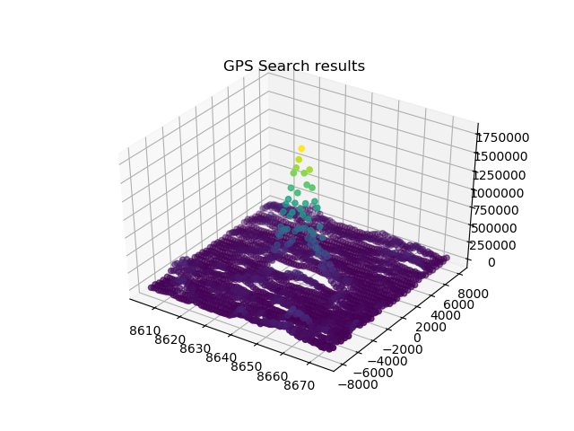
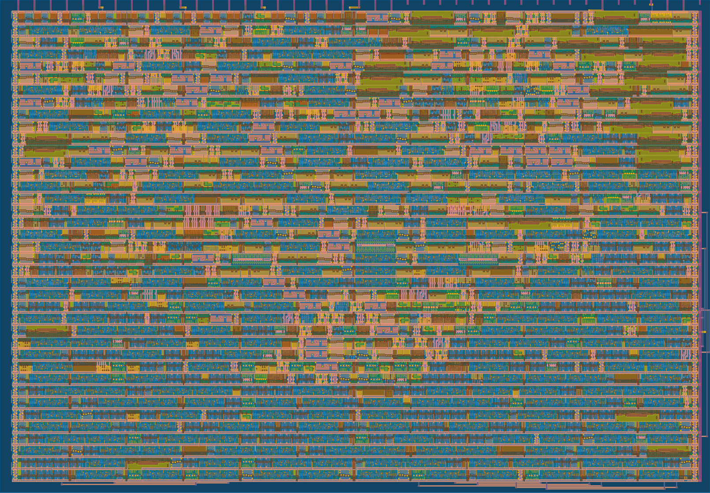

   

# GPS signal generator

## Description

The gps signal generator is a configurable block capable used to test search algorithms for GPS receivers. It is composed by two main blocks:

- Register bank: a set of configuration registers with a uart rx interface for write-only  operations. These registers lets the user control: satellite ID, PRN code phase, doppler frequency, noise level, among others.

- Core: the core of the project is composed by a Gold Code generator, an NCO (numerically controlled oscillator) and PRNGs (pseudo random number generators). The core also provides a 1-bit message input to modulate the generated signal with a "navigation message".

More detailed description can be found in [info.md](./docs/info.md)

### Example: expected output of a search algorithm

## Block diagram

## GDS render

## What is Tiny Tapeout?

Tiny Tapeout is an educational project that aims to make it easier and cheaper than ever to get your digital and analog designs manufactured on a real chip.

To learn more and get started, visit https://tinytapeout.com.

## Resources

- [FAQ](https://tinytapeout.com/faq/)
- [Digital design lessons](https://tinytapeout.com/digital_design/)
- [Learn how semiconductors work](https://tinytapeout.com/siliwiz/)
- [Join the community](https://tinytapeout.com/discord)
- [Build your design locally](https://docs.google.com/document/d/1aUUZ1jthRpg4QURIIyzlOaPWlmQzr-jBn3wZipVUPt4)
