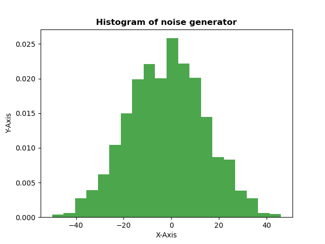

# SNR

The main purpose of these tests is to determine the mapping from SNR configuration in register bank to actual change in dB at the output.

A secondary purpose is to create the noise histogram by running simulations of the generated noise:



## How to run:

The simulator used here is icarus verilog. To run and generate .vcd waveforms do:

```bash
make WAVES=1
```

Otherwise, if you don't specify WAVES=1, it will run without waveforms generation.


## How it works:

The methodology followed to determine SNR is:

1 - Reset the core, disable noise signal and capture N_SAMPLES from its output. These samples represent the "clean" signal.
2 - Reset the core, enable noise signal and capture the same amount of N_SAMPLES. These captured samples represent "signal + noise".
3 - Do the difference of the arrays in steps 1 and 2 to get only the noise.
4 - For each array (signal and noise), square the array (^2) and calculate the mean. Then, conver to dB.
5 - Do the difference of signal dBs with noise dBs to get the SNR.


